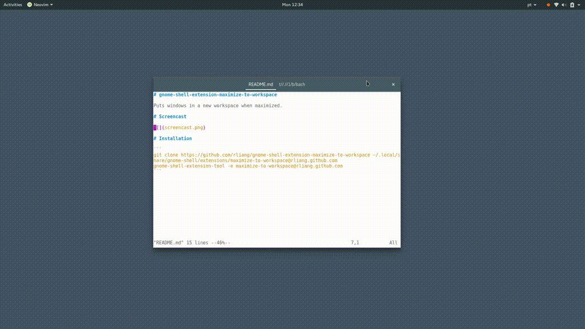

# gnome-shell-extension-maximize-to-workspace

Puts windows in a new workspace when maximized.

# Screencast



# Installation

### From GNOME Shell Extensions

Install from [here](https://extensions.gnome.org/extension/1181/maximize-to-workspace/), or use the command `gdbus call --session --dest org.gnome.Shell --object-path /org/gnome/Shell --method org.gnome.Shell.Extensions.InstallRemoteExtension "'maximize-to-workspace@rliang.github.com'"`

### From source

```
git clone https://github.com/rliang/gnome-shell-extension-maximize-to-workspace ~/.local/share/gnome-shell/extensions/maximize-to-workspace@rliang.github.com
gnome-shell-extension-tool -e maximize-to-workspace@rliang.github.com
```
